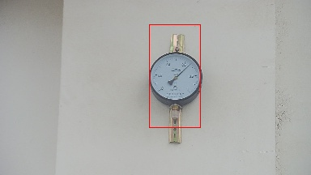

# 电表检测

本项目使用 OpenCV 和 HOG（Histogram of Oriented Gradients）特征提取结合 SVM（Support Vector Machine）分类器，实现电表检测功能。该项目通过训练模型对测试图像进行预测，并标记检测到的电表位置。

------

## 概述

该项目旨在通过机器学习技术检测图像中的电表。主要功能包括：

1. **HOG 特征提取**：从正负样本中提取 HOG 描述子。
2. **SVM 训练**：基于提取的 HOG 描述子训练一个线性核函数的 SVM 分类器。
3. **滑动窗口检测**：在测试图像上使用滑动窗口检测电表，并标记检测结果。

------

## 安装

### 前置条件

- **C++ 编译器**：确保安装了 C++ 编译器（如 GCC 或 Clang）。
- **OpenCV**：安装 OpenCV 库（推荐版本 4.x）。

#### 安装 OpenCV

```cmd
# 在 Ubuntu 上
sudo apt-get update
sudo apt-get install libopencv-dev

# 在 macOS 上
brew install opencv
```

### 编译和运行

1. 克隆本仓库：

   ```bash
   git clone https://github.com/yourusername/electricity-meter-detection.git
   cd electricity-meter-detection
   ```

2. 编译代码：

   ```bash
   mkdir build && cd build
   cmake .. && make
   ```

3. 运行程序：

   ```
   ./electricity_meter_detection
   ```

------

## 使用方法

1. **准备数据集**：
   - 将正样本（包含电表的图像）放入 `src/elec_watch/positive/` 目录。
   - 将负样本（不包含电表的图像）放入 `src/elec_watch/negative/` 目录。
   - 测试图像应放入 `src/elec_watch/test/` 目录。
2. **运行程序**： 程序会自动生成数据集、训练 SVM 模型，并对测试图像进行预测。检测结果将保存在 `src/elec_watch/test_result/` 目录中。

------

## 代码工作流程

代码的主要步骤如下：

1. **生成数据集**：
   - 从正负样本目录中读取图像。
   - 提取每张图像的 HOG 描述子。
   - 构建训练数据矩阵和标签矩阵。
   - 正样本标签为 `1`，负样本标签为 `-1`。
2. **SVM 训练**：
   - 使用线性核函数训练 SVM 分类器。
   - 设置超参数：
     - `C=2.67`：控制误分类惩罚。
     - `Gamma=5.383`：影响样本的影响范围。
   - 保存训练好的模型到 `src/elec_watch/SVM/svm_model.xml`。
3. **滑动窗口检测**：
   - 对测试图像进行缩放处理（最大尺寸不超过 1024x1024）。
   - 使用滑动窗口（大小为 64x128）遍历图像。
   - 提取每个窗口的 HOG 描述子并使用 SVM 模型预测。
   - 根据预测结果计算窗口的平均位置，并绘制检测框。
4. **保存检测结果**：
   - 如果检测到电表，绘制矩形框并保存检测结果。
   - 如果未检测到电表，输出提示信息。

------

## 结果展示

以下是程序生成的中间结果和最终结果：

### 中间结果

- **正负样本 HOG 特征提取**：
  - 正样本图像经过 HOG 提取后，生成固定长度的描述子（3780 维）。
  - 负样本同样生成对应的 HOG 描述子。
- **SVM 模型训练**：
  - 训练完成后，模型保存为 `svm_model.xml`。

### 最终输出

- 检测结果
- 检测到的电表位置用红色矩形框标记。
- 输出图像保存在 `src/elec_watch/test_result/` 目录中。



